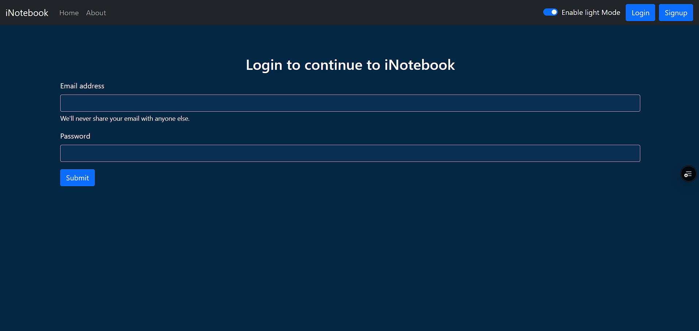
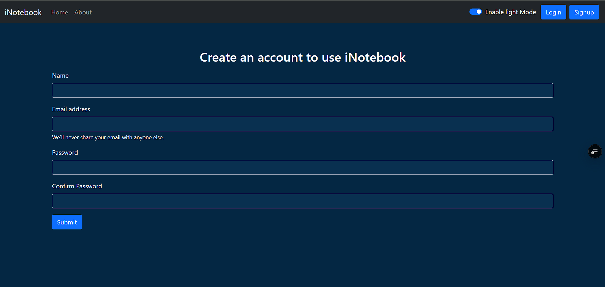
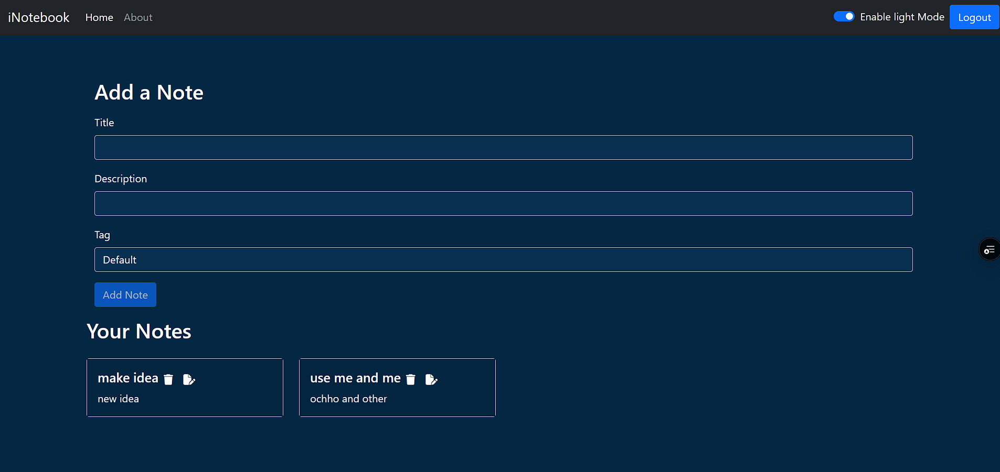
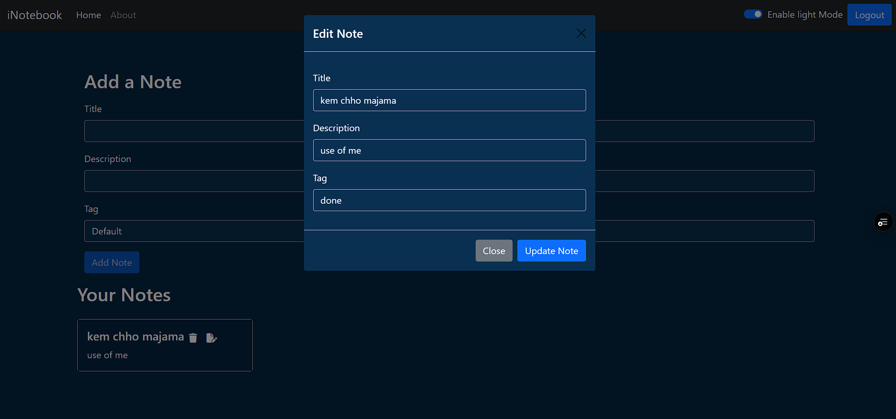

# 📓 iNotebook Web Application

**iNotebook** is a secure, full-stack web application designed to help users create, manage, and organize personal notes in the cloud. With intuitive UI/UX, robust authentication, and real-time data operations, iNotebook provides a seamless note-taking experience.

---

## 🌟 Key Features

- ✅ **User Authentication** – Secure registration and login using JSON Web Tokens (JWT).
- 🗃️ **Personalized Note Management** – Create, read, update, and delete notes tailored to each authenticated user.
- 🧠 **Modal-Based Editing** – Edit notes efficiently with a modern modal popup interface.
- 💾 **Persistent Storage** – Notes are stored in a MongoDB database, accessible only by the authenticated user.
- 📱 **Responsive UI** – Clean and responsive frontend built with modern web technologies.

---

## 🖥️ Screenshots

### 🔐 Login Page

Secure user login screen.


### 📝 Registration Page

New users can sign up to start using iNotebook.


### 🏠 Home / Dashboard

Authenticated users can view, edit, and delete their notes.


### ✏️ Update Note Modal

Modern modal interface for editing existing notes.


---

## 🛠️ Technology Stack

### Frontend

- React.js
- HTML5 & CSS3
- Bootstrap / Tailwind CSS (if used)
- JavaScript (ES6+)

### Backend

- Node.js
- Express.js

### Database

- MongoDB with Mongoose

### Authentication

- JWT (JSON Web Tokens)
- bcrypt.js for password hashing

---

## 🧑‍💻 Getting Started

### Prerequisites

- Node.js and npm installed
- MongoDB instance (local or cloud)

### Installation

1. **Clone the repository**

```bash
git clone https://github.com/yourusername/inotebook.git
cd inotebook
```

2. **Install dependencies**

```bash
npm install
cd backend
npm install
```

3. **Set up environment variables**
   Create a `.env` file in the root directory with the following:

```env
PORT=5000
MONGO_URI=your_mongodb_connection_string
JWT_SECRET=your_jwt_secret_key
```

4. **Run the application**

```bash
# Run backend
npm run server

# In a new terminal tab, run frontend
npm start
```

---

## 🛡️ Security

- All API routes are protected using JWT.
- User passwords are hashed and salted using bcrypt.
- CORS and input validation implemented for secure data handling.

---

## 🤝 Contributing

Contributions are welcome! Please fork the repository and create a pull request.

---

## 📄 License

This project is licensed under the MIT License - see the [LICENSE](/LICENSE) file for details.

---

## 📬 Contact

Created by [Darshan] – reach out via [codewithdp2073@email.com](mailto:codewithdp2073@email.com)
